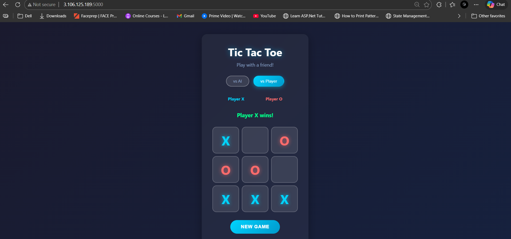

# Tic Tac Toe

A web-based Tic Tac Toe game built with Python and Flask.

## Features
- Play against AI (unbeatable)
- Play against another player (2-player mode)
- Clean and responsive UI

## How to Run Locally

1. Install Flask:
   ```bash
   pip install Flask
   ```

2. Run the app:
   ```bash
   python app.py
   ```

## Project Structure
- `app.py`          — Flask backend
- `templates/`      — HTML files
- `requirements.txt` — Python dependencies
- `DEPLOY.md`       — AWS EC2 deployment guide

## Screenshots


## License
MIT